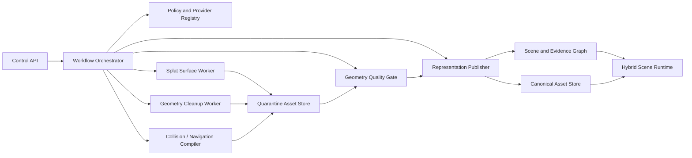

# Hybrid Representation Services and Trust Boundaries

## 1. Purpose

This module places the v1.1 hybrid-representation capability into SIP's logical and deployment architecture. It defines the service boundaries required to create, validate, publish, stream, and retire visual splats, metric meshes, interaction proxies, collision volumes, navigation surfaces, occlusion hulls, and design meshes without allowing one representation to inherit another representation's authority.

## 2. Architectural principle

A SIP scene is a coordinated collection of registered representations, not a single canonical 3D file. The scene graph and evidence graph are authoritative for identity, lineage, permissions, and assertions. Binary geometry assets are immutable content-addressed products linked to that semantic state.

The minimum runtime roles are:

| Role | Purpose | Typical producer | Trust posture |
|---|---|---|---|
| `visual_splat` | photoreal appearance and presence | Gaussian reconstruction pipeline | visual, non-metric |
| `metric_surface` | calibrated geometric reference | LiDAR/TSDF/survey workflow | conditional metric authority |
| `interaction_proxy` | picking, clipping, occlusion, approximate physics | surface provider | derived, non-authoritative |
| `collision_volume` | collision and constrained locomotion | voxel/proxy pipeline | derived, use-bounded |
| `navigation_surface` | walkable path planning and guided tours | navigation compiler | derived, use-bounded |
| `design_mesh` | proposed or authored condition | BIM/CAD/authoring system | design authority only |
| `evidence_source` | source facts and provenance | capture/import/interview systems | authority limited to supported assertion |

## 3. Service topology



### 3.1 Control API

Accepts typed operations, applies tenant/project authorization, validates intended use, estimates cost, creates idempotency keys, and exposes status. It never passes arbitrary shell arguments or unvalidated provider parameters to workers.

### 3.2 Policy and provider registry

Stores signed provider manifests, exact image or package digests, deployment mode, network behavior, accepted data classes, license evidence, approval expiration, benchmark profile, and prohibited purposes. Admission fails closed when any required decision is unknown or expired.

### 3.3 Splat surface worker

Runs one approved provider adapter in an isolated job. It receives immutable asset references and emits candidate assets and an operation receipt. It has no permission to publish into an accepted scene revision.

### 3.4 Geometry cleanup worker

Performs deterministic or journaled filtering, component selection, normal repair, hole policy, decimation, LOD generation, support-map generation, and transform validation. Destructive edits always create derivatives.

### 3.5 Collision and navigation compiler

Builds use-specific assets rather than assuming a render mesh is valid for physics. It can produce sparse voxel structures, collision GLBs, walkable surfaces, room/portal graphs, trigger volumes, and spatial-audio boundaries.

### 3.6 Geometry quality gate

Runs transform, bounds, topology, distance-to-reference, collision, navigation, anchor, visual-alignment, privacy, and performance tests. Results are profile-specific and immutable.

### 3.7 Representation publisher

Creates the semantic asset registration only after policy and quality gates. Publication is an atomic scene-commit operation. It assigns role and authority from policy; it cannot infer either from file extension, provider name, appearance, or user-selected label.

### 3.8 Hybrid scene runtime

Loads the approved subset of representations for the current audience, device, branch, and purpose. It may use a hidden proxy for interaction while rendering a splat, but exposes source and authority in evidence/debug views.

## 4. Trust boundaries

1. **Client boundary:** browser, headset, and mobile clients receive only authorized scene manifests and signed asset URLs.
2. **Control boundary:** APIs can schedule work but cannot directly execute provider code.
3. **Research boundary:** research providers run in isolated pools without production credentials or unrestricted egress.
4. **External-provider boundary:** exports require explicit policy approval and a recorded receipt; sensitive source data is denied by default.
5. **Quarantine boundary:** all untrusted or newly generated geometry remains non-routable to customer scenes until validation.
6. **Publication boundary:** only the publisher can attach accepted derivatives to a scene commit.
7. **Evidence boundary:** conversion and cleanup services cannot alter assertions, consent, or source evidence.

## 5. Deployment profiles

### 5.1 Local-only

All source assets, conversions, and viewers remain on customer-controlled hardware. Provider images are preloaded and network egress is disabled. This is the default eligible profile for restricted construction and private-family data.

### 5.2 Hybrid

Source data remains local or in an approved region. Only policy-approved derivatives can enter cloud processing. A manifest records which bytes crossed the boundary and why.

### 5.3 Managed cloud

Workers run in tenant-isolated namespaces with per-job identities, encrypted staging, bounded retention, and audited provider admission. Critical-infrastructure scenes may require dedicated deployment and customer-controlled keys.

### 5.4 Manual external

The system creates a minimized export package and requires a human conversion receipt. This mode is unavailable for prohibited data classes and cannot be an unattended production dependency.

## 6. Failure isolation

A failure in splat-to-surface conversion must not block viewing the visual splat or metric scene. A failed collision compiler must not invalidate a previously published proxy. A malformed output remains quarantined. A provider rollback restores the prior adapter/configuration but never deletes its historical provenance.

## 7. Event flow

```text
representation.operation.requested
representation.operation.admitted | rejected
representation.provider.started
representation.provider.completed | failed
representation.output.quarantined
representation.validation.completed
representation.review.requested
representation.publication.approved | rejected
representation.asset.published
representation.asset.superseded | retired
```

Events contain identifiers and hashes, not unrestricted sensitive geometry. Asset access remains separately authorized.

## 8. Repository impact

```text
services/
  representation-api/
  provider-registry/
  representation-publisher/
workers/
  splat-surface/
  geometry-cleanup/
  collision-navigation/
  representation-quality/
packages/
  representation-contracts/
  provider-sdk/
  support-maps/
  geometry-policy/
apps/web-viewer/src/hybrid-runtime/
```

Adapters for individual tools live under `adapters/spatial-providers/` and cannot leak provider-specific fields into domain schemas.

## 9. Normative requirements

| ID | Priority | Requirement | Verification |
|---|---|---|---|
| ARCHHYB-001 | P0 | SIP shall implement hybrid representation through isolated control, provider, quarantine, validation, publication, and runtime boundaries. | Architecture and deployment test |
| ARCHHYB-002 | P0 | Only the representation publisher shall attach an accepted derivative to a scene commit, and publication shall be atomic. | Authorization and transaction test |
| ARCHHYB-003 | P0 | Provider workers shall have no permission to modify source evidence, assertions, consent, authority labels, or accepted scene revisions. | Least-privilege test |
| ARCHHYB-004 | P0 | Unknown, expired, or incompatible provider policy shall fail closed before source asset access. | Negative policy test |
| ARCHHYB-005 | P0 | Generated outputs shall enter a quarantine store and shall not be served to customer runtimes before validation. | Security integration test |
| ARCHHYB-006 | P0 | Sensitive construction and LiveForever data shall remain within an approved deployment and egress boundary. | Data-flow and egress test |
| ARCHHYB-007 | P0 | A provider or compiler failure shall not mutate canonical source assets or the last accepted representation. | Fault-injection and rollback test |
| ARCHHYB-008 | P1 | The runtime shall select assets by role, branch, audience, device capability, and intended use rather than file extension. | Runtime selection test |
| ARCHHYB-009 | P1 | Collision, navigation, occlusion, and display derivatives shall be independently replaceable and versioned. | Component replacement test |
| ARCHHYB-010 | P1 | Provider adapters shall remain outside domain schemas and shall conform to a stable provider SDK. | Adapter conformance test |
| ARCHHYB-011 | P1 | Local-only, hybrid, managed-cloud, and manual-external modes shall share the same operation and provenance contracts. | Cross-profile contract test |
| ARCHHYB-012 | P1 | Hybrid-representation events shall avoid embedding unrestricted source geometry and shall use separately authorized asset references. | Event privacy test |
| ARCHHYB-013 | P1 | The platform shall expose operational metrics for queueing, compute, validation, publication, cache behavior, and runtime performance without requiring raw-scene inspection. | Observability test |
| ARCHHYB-014 | P1 | A provider replacement or deprecation shall not require migration of semantic entities, evidence, consent, or stable public APIs. | Provider substitution test |

## 10. Acceptance

The reference deployment shall process the same synthetic hybrid scene using a local provider and a manual fixture provider, quarantine both outputs, validate them, publish one, reject the other, and prove that source assets and the prior accepted scene remain byte-identical.
