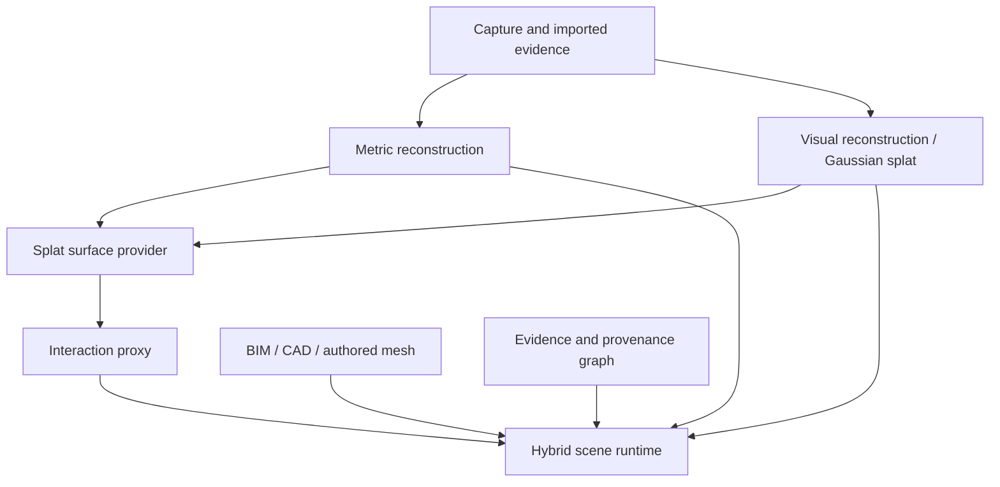

# Splat-to-Surface and Hybrid Representation

## 1. Purpose

This specification defines how SIP combines photoreal Gaussian splats with metric meshes, design models, and derived interaction geometry. It introduces a non-authoritative interaction representation so a visually rich scene can support conventional 3D operations without misrepresenting visual reconstruction as measured truth.

## 2. Problem statement

Gaussian splats preserve view-dependent appearance, fine texture, and visual presence, but do not inherently provide stable triangle identities, watertight topology, walkable surfaces, collision behavior, conventional sectioning, or reliable measurement. A polygon mesh or voxel structure can provide those functions, but a mesh extracted from a splat is an approximation influenced by the training views, density field, extraction method, cleanup, and decimation.

SIP therefore keeps the source splat, metric geometry, derived proxy, design geometry, and evidence linked but independently versioned.

## 3. Four coordinated layers

| Role | Primary use | Examples | May drive measurement? |
|---|---|---|---:|
| `metric_surface` | metric reference and verified geometry | LiDAR/TSDF mesh, survey-controlled point cloud | only when authority and verification permit |
| `visual_splat` | photoreal rendering | 3DGS/2DGS-derived scene | no |
| `interaction_proxy` | raycast, collision, navigation, occlusion | extracted/decimated GLB, voxel collision | no |
| `design_mesh` | intended/proposed condition | IFC/BIM equipment, proposed route | design intent only |
| `evidence_source` | source and review facts | images, videos, drawings, interviews | only for the supported assertion |

## 4. Permitted uses of an interaction proxy

- viewer raycasting and stable object selection;
- collision detection and camera constraints;
- navigation-mesh generation and path planning for presentation;
- section-box interaction and room clipping;
- label occlusion and depth prepasses;
- spatial-audio boundaries and trigger volumes;
- approximate physics for non-safety-critical experiences;
- anchoring a semantic object through a support map that can be reprojected after remeshing;
- web and VR level-of-detail representations;
- fallback visualization when the visual splat is unsupported.

## 5. Prohibited uses

An interaction proxy shall not independently establish:

- survey-grade or field-verified dimensions;
- code compliance, fire-device spacing, accessibility clearance, egress width, or equipment working clearance;
- fabrication dimensions, sleeve/core locations, or construction layout;
- verified as-built status;
- exact collision for autonomous machinery or safety systems;
- historical certainty in LiveForever;
- identity of a person or object;
- a substitute for evidence or consent.

## 6. Provider families

The orchestrator supports multiple provider families behind the contract in `416_splat_surface_provider_contract.md`:

1. **Local deterministic geometry providers** — TSDF, Poisson, voxel/SVO, or mesh simplification using approved libraries.
2. **Joint splat-and-mesh research providers** — methods that optimize or extract surfaces from Gaussian representations.
3. **Post-process splat-to-mesh providers** — extract a surface from an existing splat and optionally texture it.
4. **Manual external providers** — a human exports an approved asset, operates an external tool, and imports the result with a signed conversion receipt.
5. **Native hybrid runtime** — no extraction is required when a visual splat and existing metric/design mesh already satisfy interaction needs.

Provider selection is policy-driven by data classification, intended use, license status, scene scale, hardware, operating envelope, and required reproducibility.

## 7. Partitioning and scale

Building-scale processing shall use spatial partitions rather than one unbounded scene. Partitions may follow building, level, zone, room, capture segment, or spatial tile boundaries. Each partition records overlap, seam strategy, parent coordinate frame, bounding volume, level-of-detail family, and recomposition order.

A partition may be regenerated without invalidating neighboring assets when boundary compatibility checks pass. Cross-partition anchors use world-frame positions and semantic entity identifiers, not provider-local triangle numbers.

## 8. Surface-generation workflow

1. Validate source asset, coordinate frame, policy, provider approval, and intended use.
2. Create an immutable operation manifest and freeze inputs by content hash.
3. Normalize the visual representation without changing the canonical source.
4. Optionally constrain extraction with an accepted metric surface, masks, floor planes, or protected regions.
5. Execute the provider in an isolated environment or create a manual-export package.
6. Import the raw candidate as `derived_unreviewed`.
7. Run topology, scale, transform, coverage, collision, navigation, and visual-alignment tests.
8. Compare the candidate against accepted metric geometry where available.
9. Produce separate optimized derivatives for rendering, collision, navigation, and occlusion as required.
10. Publish only after automated gates and the required human review pass.

## 9. Quality dimensions

Quality evaluation shall be use-specific. A proxy can be acceptable for clicking but unacceptable for locomotion.

- transform and scale agreement;
- surface distance to metric reference;
- coverage and unsupported geometry;
- false bridges, floaters, holes, self-intersections, and inverted normals;
- preservation of doors, stairs, rails, thin piping, panel faces, furniture, and meaningful objects;
- collision leakage and false barriers;
- walkable-slope correctness and disconnected navigation islands;
- raycast stability across level-of-detail changes;
- visual parallax/occlusion alignment;
- memory, draw-call, load-time, and frame-time budgets;
- deterministic or bounded-repeatability behavior.

## 10. Authority and user-interface rules

The viewer shall distinguish visual, metric, design, and proxy layers. A measurement started on a proxy hit must re-resolve against an eligible metric surface or require field verification. When no eligible surface exists, the user sees `approximate visual reference` and cannot save it as verified.

Debug and evidence views shall expose the proxy source, provider, algorithm version, extraction date, coverage, support map, benchmark status, and limitations. Customer-facing presentation may hide the proxy rendering, but not its provenance when it affects interaction.

## 11. Failure and fallback

- Provider failure preserves the visual splat and accepted metric scene.
- Low-quality extraction cannot replace a previously accepted proxy.
- A corrupted or misregistered proxy is quarantined.
- The runtime falls back independently for picking, collision, navigation, and occlusion.
- A visual scene remains viewable even when no proxy is available.
- A proxy is regenerable from immutable sources; manual edits are replayed through an edit journal or preserved as a separate authored derivative.

## 12. Normative requirements

| ID | Priority | Requirement | Verification |
|---|---|---|---|
| RECHYB-001 | P0 | SIP shall store metric, visual, interaction, design, and evidence roles independently while registering them to explicit coordinate frames. | Schema and integration test |
| RECHYB-002 | P0 | Every interaction proxy shall carry authority class `derived_non_authoritative` and shall be ineligible for verified measurement by itself. | Policy test |
| RECHYB-003 | P0 | A splat-to-surface operation shall preserve immutable source hashes, provider identity, exact version, parameters, environment, output hashes, validation, and publication decision. | Provenance test |
| RECHYB-004 | P0 | The system shall validate transform, scale, coverage, topology, collision behavior, and intended-use suitability before proxy publication. | Benchmark gate |
| RECHYB-005 | P0 | Construction measurements initiated from a proxy shall resolve to eligible metric evidence or remain explicitly approximate and unverified. | End-to-end test |
| RECHYB-006 | P0 | Sensitive scenes shall not leave an approved trust boundary through a manual or hosted provider without a matching policy approval. | Security test |
| RECHYB-007 | P0 | Semantic anchors shall not depend solely on provider-local triangle indices that may change after remeshing or decimation. | Remesh regression test |
| RECHYB-008 | P0 | Provider failure or rejection shall not modify the accepted metric scene, source splat, or prior published proxy. | Transaction and rollback test |
| RECHYB-009 | P1 | The pipeline shall support separate derivatives for display, collision, navigation, occlusion, and spatial audio when one mesh cannot satisfy all budgets. | Integration test |
| RECHYB-010 | P1 | Building-scale scenes shall support tiled processing, overlap validation, seam checks, and independent partition regeneration. | Large-scene test |
| RECHYB-011 | P1 | The viewer shall provide an authorized diagnostic mode exposing layer roles, authority, provider, coverage, and limitations. | UI acceptance test |
| RECHYB-012 | P1 | The runtime shall provide component-level fallbacks when proxy picking, collision, navigation, or occlusion is unavailable. | Fault-injection test |
| RECHYB-013 | P1 | Surface quality gates shall be selected by intended use rather than a single global pass/fail score. | Policy and benchmark test |
| RECHYB-014 | P1 | Manual cleanup shall be replayable or preserved as a separately versioned authored derivative with edit provenance. | Reproducibility test |
| RECHYB-015 | P1 | A visual splat shall remain independently viewable and exportable when surface extraction is disabled or unsuccessful. | Compatibility test |
| RECHYB-016 | P1 | Every published proxy shall retain a machine-readable limitations statement and support-map reference. | Schema test |

## 13. Acceptance

The first accepted implementation shall demonstrate one construction room and one LiveForever room containing a visual splat, a metric reference, a derived interaction proxy, semantic anchors, and evidence. It shall show stable selection, collision, navigation, and occlusion while proving that a proxy-derived measurement cannot become verified without metric or field evidence.
