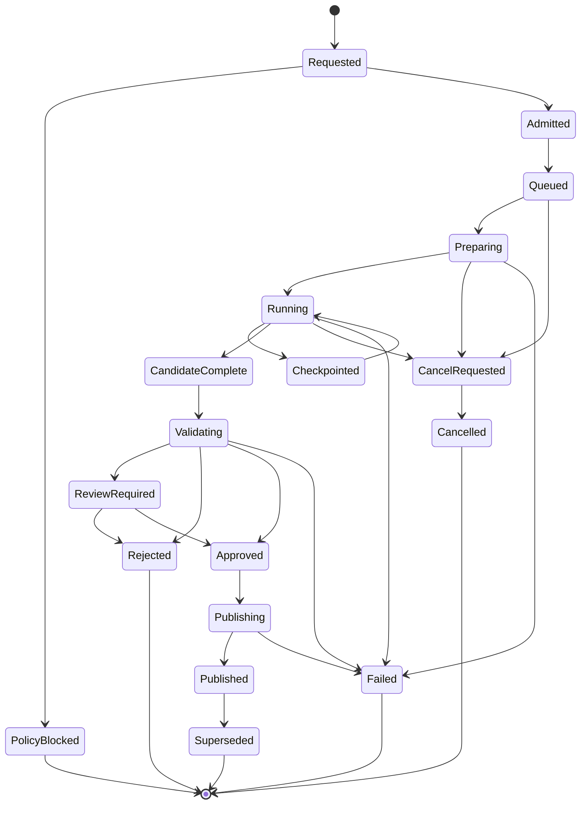

# Splat-Surface APIs, Jobs, and Domain Events

## 1. Purpose

This document defines the public control APIs, internal worker contracts, durable job state, review commands, and domain events for hybrid representation operations. The contracts implement the provider and asset rules in:

- [`../40-reconstruction/416_splat_surface_provider_contract.md`](../40-reconstruction/416_splat_surface_provider_contract.md)
- [`../50-data/514_hybrid_representation_asset_contract.md`](../50-data/514_hybrid_representation_asset_contract.md)
- [`613_hybrid_scene_runtime.md`](613_hybrid_scene_runtime.md)

Binary assets move through authorized object-transfer mechanisms. REST and events carry manifests, identifiers, hashes, and bounded summaries rather than embedding large geometry.

## 2. Resource model

Primary resources:

- `spatial-conversion-operation` — immutable admitted intent and current lifecycle;
- `provider-candidate` — a provider/version evaluated for the request;
- `provider-run` — one execution attempt;
- `representation-candidate` — staged output awaiting independent validation;
- `representation-validation` — intended-use metrics, findings, and decision;
- `representation-publication` — atomic binding of an approved asset to a scene revision;
- `hybrid-scene-view` — short-lived authorized runtime manifest;
- `support-remap-operation` — anchor remapping after replacement or LOD change;
- `manual-provider-package` — controlled outbound and return receipt;
- `provider-promotion` — lifecycle approval scoped by use and data class.

## 3. REST endpoints

### 3.1 Create a conversion operation

```http
POST /v1/projects/{project_id}/spatial-conversions
Idempotency-Key: 01K1...
Content-Type: application/json
```

The request follows the canonical operation contract. A successful admission returns `202 Accepted`, the operation resource, policy decision summary, selected or candidate providers, budget reservation, and operation status URL. The service may return a policy-blocked operation resource rather than losing the audit trail.

### 3.2 Read and list operations

```http
GET /v1/spatial-conversions/{operation_id}
GET /v1/projects/{project_id}/spatial-conversions?scene_revision_id=...&status=...
```

Results are permission-filtered. They expose cost, progress, warnings, provider identity, input/output references, validation, and terminal failure without revealing restricted policy logic or source media.

### 3.3 Cancel, retry, or supersede

```http
POST /v1/spatial-conversions/{operation_id}:cancel
POST /v1/spatial-conversions/{operation_id}:retry
POST /v1/spatial-conversions/{operation_id}:supersede
```

A retry preserves admitted intent and creates a new attempt. A superseding operation may change provider, parameters, constraints, sources, or intended use and therefore receives a new operation ID with an explicit predecessor link.

### 3.4 Request and record validation

```http
POST /v1/representation-candidates/{candidate_id}:validate
GET  /v1/representation-validations/{validation_id}
POST /v1/representation-validations/{validation_id}:record-review
```

The validation request identifies benchmark profiles and intended uses. Human decisions require the reviewed candidate hash, metrics, limitations, role, authority, reviewer identity, and reason. A review cannot waive an authority ceiling.

### 3.5 Publish or reject a candidate

```http
POST /v1/representation-candidates/{candidate_id}:publish
POST /v1/representation-candidates/{candidate_id}:reject
```

Publication is conditional on a fresh validation, policy approval, output hash, intended-use decision, current source revision, and no incompatible deletion/consent change. The command atomically creates or supersedes representation bindings in a target scene commit.

### 3.6 Generate a hybrid scene view

```http
POST /v1/scenes/{scene_id}/hybrid-views
```

The request states scene revision(s), purpose, time context, device capabilities, desired interaction modes, and optional comparison branch. The response is a signed short-lived manifest. It never returns unauthorized raw assets.

### 3.7 Support-map remapping

```http
POST /v1/scenes/{scene_id}/support-remaps
GET  /v1/support-remaps/{remap_id}
POST /v1/support-remaps/{remap_id}:approve
```

Remapping is required when a representation carrying cached supports is replaced. Failed or high-residual anchors enter review and prevent publication when they affect critical entities or active measurements.

### 3.8 Manual provider export and return

```http
POST /v1/spatial-conversions/{operation_id}:prepare-manual-export
POST /v1/spatial-conversions/{operation_id}:record-manual-return
```

The export endpoint applies classification and minimization policy, then produces an outbound package. Return records require hashes, tool/version, operator, options, processing/retention declaration, and uploaded files through controlled transfer. The service never interprets a returned file as published geometry.

### 3.9 Provider registry and promotion

```http
GET  /v1/spatial-providers
POST /v1/spatial-providers/{provider_id}/versions
POST /v1/spatial-providers/{provider_id}/versions/{version}:promote
POST /v1/spatial-providers/{provider_id}/versions/{version}:block
```

Registry mutations require a privileged governance role and immutable evidence. Promotion is scoped by execution zone, classification, scene class, output role, intended use, hardware profile, and expiration/review date.

## 4. Operation state machine



`Published` means a domain transaction committed the new representation binding. Worker completion alone is only `CandidateComplete`.

## 5. Internal worker API

The internal worker boundary uses gRPC, a durable command bus, or an equivalent protocol with these logical methods:

```protobuf
service SpatialConversionWorker {
  rpc Inspect(InspectRequest) returns (InspectResult);
  rpc Plan(PlanRequest) returns (PlanResult);
  rpc Execute(ExecuteRequest) returns (stream WorkerEvent);
  rpc Cancel(CancelRequest) returns (CancelResult);
  rpc Resume(ResumeRequest) returns (stream WorkerEvent);
  rpc CollectResult(CollectResultRequest) returns (CandidatePackage);
}
```

The control plane supplies read-only input references and a write-only staging prefix using short-lived credentials. The worker cannot publish scene bindings, modify source records, grant itself network access, or change authority. Worker events are authenticated and sequence-numbered.

## 6. Durable job contract

A job record includes:

- operation and attempt IDs;
- provider, executable, model, parameter, and environment hashes;
- input manifest and policy-admission decision;
- resource reservation and execution zone;
- stage state and monotonic sequence;
- checkpoints and their hashes;
- cancellation state;
- progress work units;
- output staging references;
- logs and trace IDs;
- cost-attribution counters;
- terminal result and cleanup confirmation.

A lease prevents concurrent execution of the same attempt. Lease expiry triggers reconciliation, not immediate duplicate execution. The reconciler checks provider/workload state, checkpoints, staging objects, and idempotency before resuming or failing the attempt.

## 7. Domain events

Events contain no raw splat, mesh, source frame, transcript, or precise restricted coordinates. Standard envelope fields include event ID, schema version, producer, occurred/recorded time, tenant/project, correlation/causation IDs, principal/workload, classification, partition key, and payload hash.

| Event | Producer | Partition key | Meaning |
|---|---|---|---|
| `SpatialConversionRequested` | conversion service | operation ID | Immutable intent recorded |
| `SpatialConversionPolicyBlocked` | policy service | operation ID | Admission denied before source access |
| `SpatialConversionAdmitted` | conversion service | operation ID | Provider and resource envelope admitted |
| `ProviderRunStarted` | orchestrator | attempt ID | Isolated execution began |
| `ProviderRunProgressed` | worker gateway | attempt ID | Objective stage progress advanced |
| `ProviderRunCheckpointed` | worker gateway | attempt ID | Durable checkpoint verified |
| `ProviderRunCancelRequested` | conversion service | attempt ID | Cancellation intent committed |
| `ProviderRunCancelled` | orchestrator | attempt ID | Execution stopped and cleanup recorded |
| `RepresentationCandidateCreated` | orchestrator | candidate ID | Immutable staged output registered |
| `RepresentationValidationStarted` | validation service | validation ID | Independent validation began |
| `RepresentationValidationCompleted` | validation service | validation ID | Metrics and use decisions recorded |
| `RepresentationReviewRequested` | review service | candidate ID | Human review required |
| `RepresentationCandidateApproved` | review/publication service | candidate ID | Candidate eligible for requested publication |
| `RepresentationCandidateRejected` | review/publication service | candidate ID | Candidate retained as rejected evidence |
| `RepresentationBindingPublished` | scene service | scene revision ID | New binding committed atomically |
| `RepresentationBindingSuperseded` | scene service | binding ID | Prior binding replaced but retained historically |
| `SupportRemapRequested` | scene service | remap ID | Replacement requires anchor remap |
| `SupportRemapCompleted` | remap service | remap ID | Remap metrics and failures recorded |
| `HybridSceneViewIssued` | view service | view ID | Authorized signed runtime manifest created |
| `RepresentationDependencyInvalidated` | policy/asset service | asset ID | Source, privacy, consent, transform, or deletion change invalidated derivatives |
| `SpatialProviderPromotionChanged` | governance service | provider version | Provider approval scope changed |

Events asserting a committed result are emitted through an outbox or equivalent atomic mechanism. Consumers are idempotent and retain processed-event identifiers.

## 8. Example operation response

```json
{
  "operation_id": "op_01K1HYBRID6C42JQH7ZRZ",
  "state": "running",
  "purpose": "interaction_proxy",
  "intended_uses": ["raycast", "collision"],
  "provider": {
    "provider_id": "local.open3d.metric_proxy",
    "provider_version": "1.4.2",
    "promotion_scope": "active:confidential_building:raycast,collision"
  },
  "progress": {
    "stage": "surface_cleanup",
    "completed_units": 26,
    "total_units": 40,
    "unit": "tiles",
    "last_checkpoint_id": "checkpoint_25"
  },
  "budget": {
    "gpu_seconds_reserved": 0,
    "cpu_seconds_reserved": 7200,
    "storage_bytes_reserved": 800000000
  },
  "links": {
    "self": "/v1/spatial-conversions/op_01K1HYBRID6C42JQH7ZRZ",
    "cancel": "/v1/spatial-conversions/op_01K1HYBRID6C42JQH7ZRZ:cancel"
  }
}
```

## 9. Error response

```json
{
  "type": "https://errors.sip.local/HYB_POLICY_EXTERNAL_TRANSFER_DENIED",
  "title": "Requested provider is not permitted for this scene",
  "status": 409,
  "code": "HYB_POLICY_EXTERNAL_TRANSFER_DENIED",
  "detail": "The requested operation requires an approved local or project-private provider.",
  "operation_id": "op_01K1...",
  "retryable": false,
  "remediation": ["remove_external_provider_preference", "request_governance_review"],
  "correlation_id": "corr_01K1..."
}
```

The response does not disclose hidden room classification, family consent terms, security-system details, or internal provider vulnerabilities.

## 10. Review and publication concurrency

Validation and review operate against an exact candidate hash and source scene revision. Publication fails with a conflict when:

- the candidate changed;
- source policy, consent, retention, legal hold, or deletion dependency changed;
- the target scene advanced incompatibly;
- the provider was blocked;
- benchmark approval expired;
- a transform or coordinate frame was superseded;
- a critical support remap remains unresolved.

The caller can revalidate or create a new operation. The service never silently publishes against stale evidence.

## 11. Agent access

Spatial agents may:

- list approved provider capabilities;
- request a conversion proposal and estimated cost;
- start an approved operation under user/project policy;
- inspect progress and validation;
- create review tasks;
- propose publication.

Agents may not:

- bypass policy or license gates;
- select an unapproved external provider for sensitive data;
- approve their own output;
- change authority ceilings;
- verify construction measurements;
- suppress truth labels;
- publish generated LiveForever content as observed fact;
- expand an audience or consent purpose.

## 12. Rate, quota, and cost controls

Operations are subject to tenant/project concurrency, GPU/CPU time, input/output bytes, tile count, retries, external-provider budget, and retained-derivative quotas. The API returns a budget estimate and reservation. Material variance emits a warning and can pause for approval. Cost records attribute provider execution, storage, egress, validation, human review, and runtime delivery.

## 13. Normative requirements

| ID | Priority | Requirement | Verification |
|---|---|---|---|
| HYBAPI-001 | P0 | Public APIs shall represent spatial conversion, validation, publication, support remap, provider promotion, manual export/return, and hybrid scene views as versioned resources and explicit commands. | OpenAPI contract test |
| HYBAPI-002 | P0 | Creating, retrying, cancelling, validating, reviewing, and publishing shall be idempotent within their documented keys and state preconditions. | Concurrency and retry test |
| HYBAPI-003 | P0 | Worker completion shall create a candidate only; scene publication shall occur in a separate authoritative transaction after independent validation. | End-to-end state test |
| HYBAPI-004 | P0 | The control plane shall issue least-privilege, short-lived, read-only input and write-only staging credentials to workers. | Security integration test |
| HYBAPI-005 | P0 | Events that assert publication, approval, cancellation, or invalidation shall be emitted only after the corresponding transaction commits. | Outbox consistency test |
| HYBAPI-006 | P0 | A publication command shall reject stale candidate, policy, consent, provider, benchmark, transform, scene, or support-remap state. | Optimistic-concurrency test |
| HYBAPI-007 | P0 | API and event payloads shall avoid raw geometry, media, transcripts, and restricted coordinates and shall return only authorized references and bounded summaries. | Data-leakage test |
| HYBAPI-008 | P0 | Manual external provider return shall require a conversion receipt and shall enter validation rather than publication. | Manual workflow test |
| HYBAPI-009 | P1 | Durable jobs shall support leases, verified checkpoints, cancellation, reconciliation, bounded retries, and exactly-once publication effect. | Fault-injection test |
| HYBAPI-010 | P1 | Progress shall use stage work units and durable checkpoints with sequence numbers. | Event ordering test |
| HYBAPI-011 | P1 | Provider promotion APIs shall scope approval by data class, scene class, role, intended use, execution zone, hardware profile, and validity period. | Governance authorization test |
| HYBAPI-012 | P1 | Hybrid scene-view manifests shall be signed, short-lived, purpose-scoped, and generated after server-side spatial and content authorization. | Manifest security test |
| HYBAPI-013 | P1 | Error responses shall use stable machine codes, safe user explanations, retry classification, and remediation without leaking restricted policy details. | Error-contract test |
| HYBAPI-014 | P1 | Agents shall use constrained tools that cannot approve their own outputs, increase authority, widen audience, or bypass consent/license policy. | Agent safety test |
| HYBAPI-015 | P1 | Cost, resource, and quota records shall be available before and after execution and attributable by operation and project. | Billing attribution test |
| HYBAPI-016 | P1 | Schema compatibility for requests, results, events, and scene-view manifests shall be validated in CI and at publication boundaries. | Schema registry test |

## 14. Acceptance

Acceptance requires a test environment in which a synthetic conversion is admitted, denied by an alternate policy, executed with progress and checkpoint events, cancelled and resumed, produces a candidate, fails one validation, succeeds after a superseding operation, receives human approval, atomically publishes, remaps anchors, issues a signed hybrid view, invalidates a derivative after a privacy change, and replays all events without duplicate side effects.
