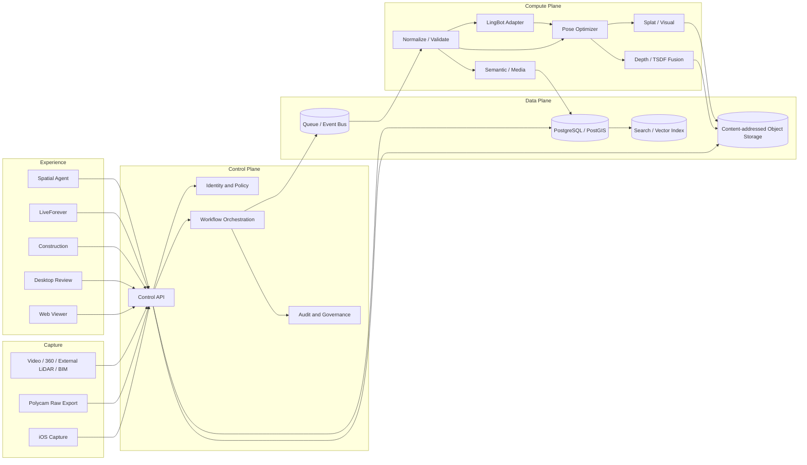
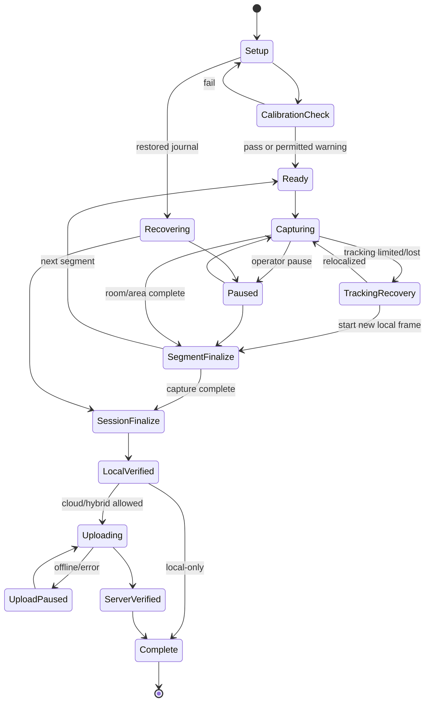
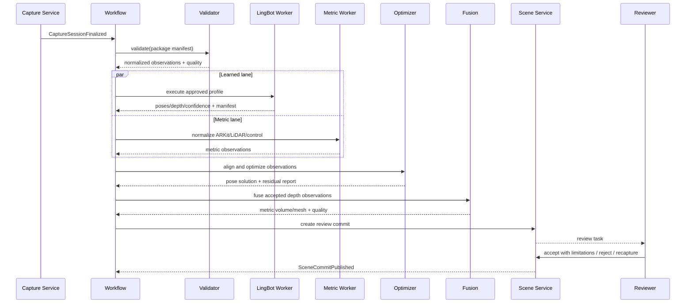
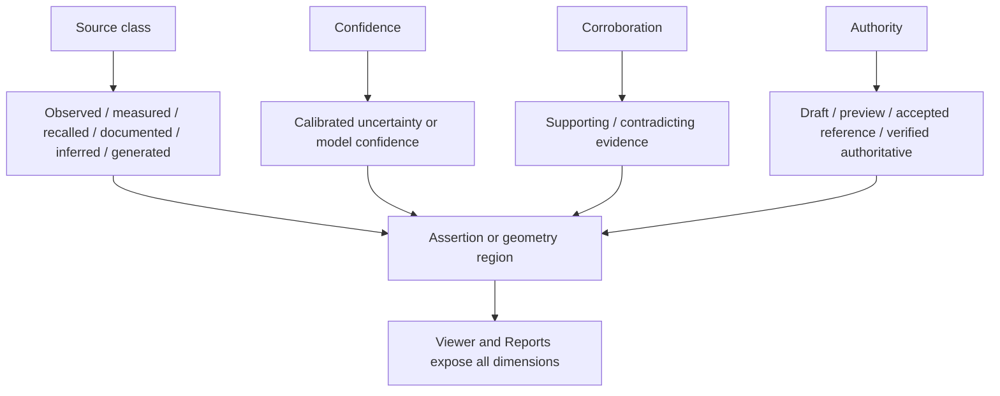
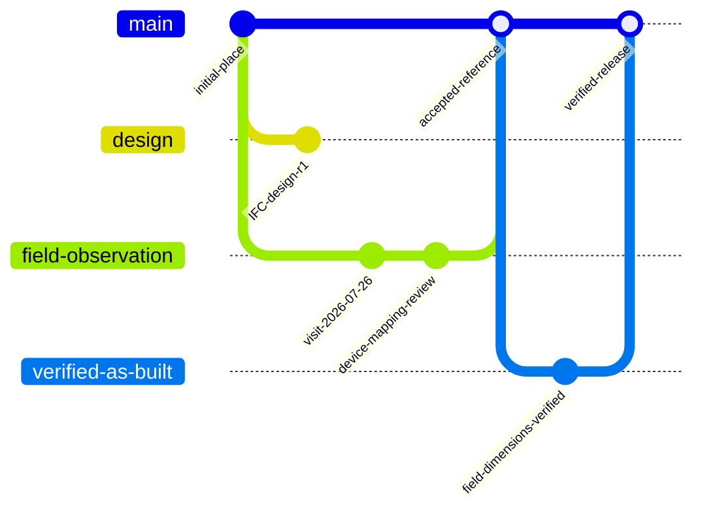
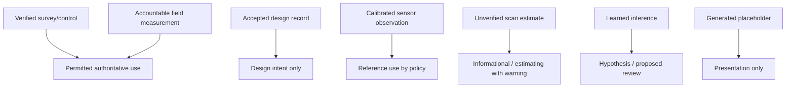
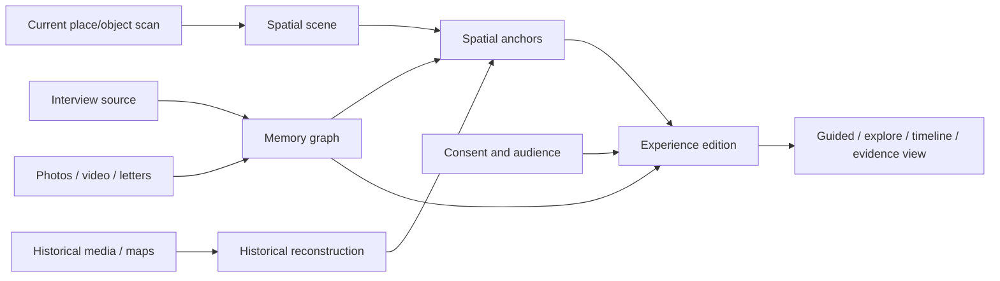
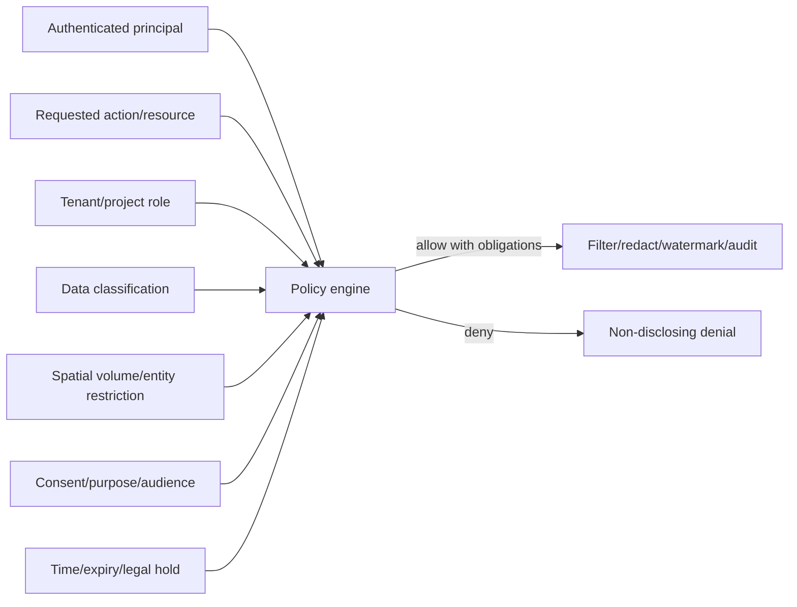
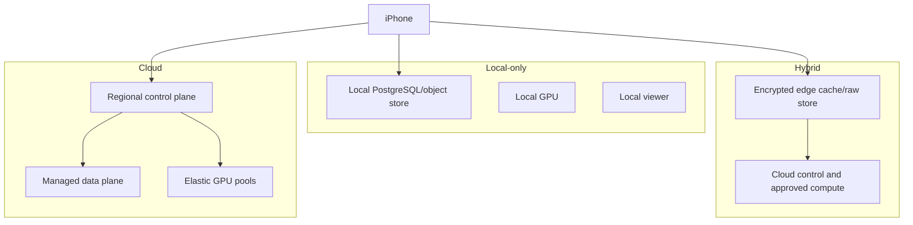

# Architecture and Workflow Diagrams

## System landscape

## Capture state machine

## Reconstruction workflow

## Truth and authority model

## Spatial Git

## Construction authority hierarchy

## LiveForever evidence-backed experience

## Permission evaluation

## Deployment profiles

## Version 1.1 diagrams

The diagram set shall include provider admission and trust boundaries, conversion/quarantine/publication state machine, hybrid runtime capability resolution, support-map anchor remapping, construction role composition, LiveForever branch/evidence composition, provider revocation, and v1.0-to-v1.1 migration.
