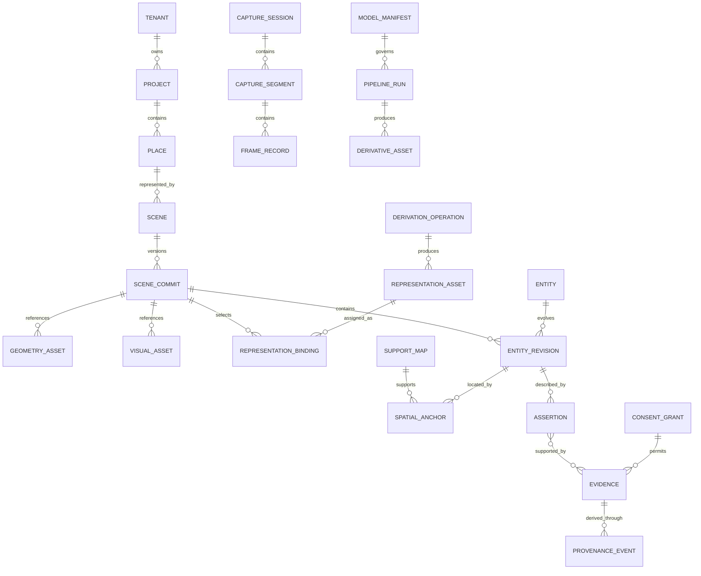
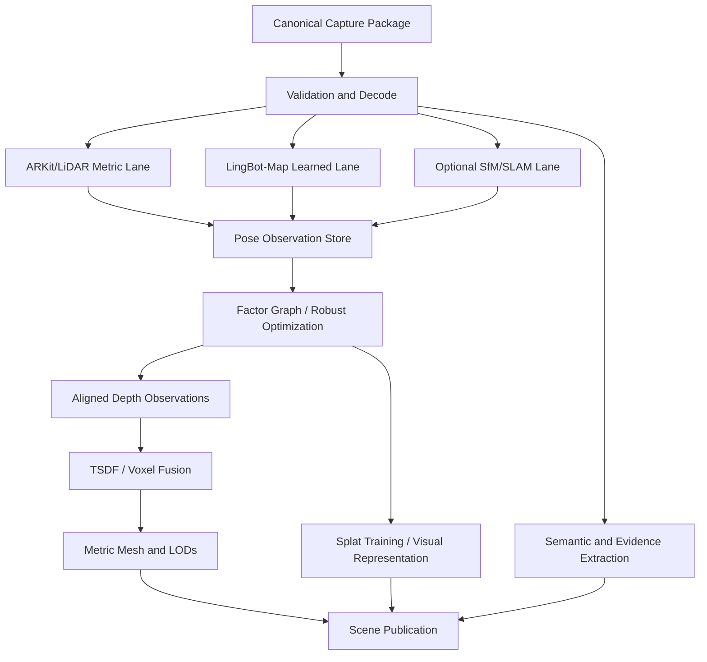

# Master Engineering Specification

## 1. Executive intent

The Spatial Intelligence Platform turns physical places into durable, queryable records. A place is not represented only as a mesh. It is represented as a coordinated set of geometry, appearance, evidence, semantic entities, permissions, timelines, workflows, and human meaning.

The platform begins with two practical needs. Construction teams need a trustworthy spatial reference for what exists, what was designed, what changed, what was tested, and what remains unresolved. Families using LiveForever need a way to preserve a person's stories in the places and objects that give those stories meaning, without allowing generation to overwrite truth or consent.

Both needs share the same hard technical problem: capture imperfect observations over time and turn them into a persistent world model while preserving where each assertion came from. SIP solves that problem with source-neutral capture, multiple reconstruction lanes, explicit uncertainty, an evidence-aware scene graph, open interchange, and vertical workflows.

## 2. Product boundary

SIP includes:

- first-party iOS/iPadOS capture;
- Polycam raw-export ingestion;
- adapters for ordinary video, image sets, external LiDAR, 360 media, survey/control points, BIM, drawings, documents, and prior scenes;
- LingBot-Map streaming/windowed inference behind a controlled adapter;
- pose alignment, scale estimation, factor-graph optimization, loop constraints, depth fusion, volumetric integration, meshing, texturing, and optional splat generation;
- splat-to-surface providers, proxy/collision/navigation/occlusion generation, bidirectional mesh-splat interoperability, and a hybrid scene runtime;
- semantic entity creation, evidence linking, temporal scene commits, search, collaboration, spatial queries, and agent tools;
- browser and desktop review experiences;
- Construction and LiveForever vertical modules;
- local-only, hybrid, and cloud operations;
- security, consent, audit, backup, export, and long-term preservation.

SIP does not promise survey-grade accuracy from an uncalibrated phone, automatic BIM without review, factual recovery of undocumented memories, consciousness emulation, or guaranteed identity reconstruction. Those claims are outside scope and must not appear in product messaging.

## 3. Core domain model

A stable `Entity` identifies a real or conceptual thing such as a room, panel, door, chair, person, memory event, photograph, or testimony. `EntityRevision` describes that thing in one scene commit or validity interval. An `Assertion` states something about it. An `Evidence` record supports, disputes, or contextualizes the assertion. Geometry and appearance are referenced, not embedded in transactional rows.

## 4. Capture architecture

### 4.1 Source-neutral normalization

All capture sources normalize to the Canonical Spatial Capture Package (CSCP). A CSCP is a directory or archive with a signed manifest, content hashes, clock information, coordinate frames, calibration, frame records, sensor streams, quality events, privacy marks, and resumable segment boundaries.

The package may contain:

- original RGB/HEIF/JPEG/RAW frames or video plus exact extraction map;
- depth and confidence maps with calibration and invalid-value encoding;
- ARKit camera transforms and tracking state;
- camera intrinsics, image dimensions, lens identity, exposure, focus, rolling-shutter metadata when available;
- IMU samples and their clock relationship;
- mesh-anchor revisions;
- optional RoomPlan output, GNSS, barometer, audio narration, fiducials, known dimensions, thermal imagery, or external control;
- operator annotations and consent/privacy markers;
- checksums and finalization signature.

### 4.2 First-party capture

The iOS app captures raw evidence while presenting live guidance. It must report tracking degradation, insufficient parallax, motion blur, glare, low light, LiDAR invalidity, repeated-texture risk, coverage gaps, and storage/battery/network constraints. Guidance uses plain operational prompts such as “slow down,” “back up,” “revisit the doorway,” or “hold the camera on this wall,” while retaining expert diagnostics for review.

Capture is segment-based. A session can span floors, rooms, days, and devices while preserving local coordinate frames and explicit links. Pausing never rewrites accepted data. Finalization hashes each segment and creates a session root hash. Upload is optional and resumable.

### 4.3 Polycam ingestion

Polycam raw exports are accepted through a dedicated adapter. Images, corrected images, camera data, depth, confidence, mesh information, video, and optimized or ARKit poses are mapped to CSCP fields. The adapter records whether global pose optimization was present; it never treats corrected poses as available when the export omitted them. Polycam remains a convenient production capture lane, while the canonical package prevents lock-in.

## 5. Reconstruction architecture

### 5.1 LingBot-Map adapter

The adapter receives decoded image frames and an execution manifest. It pins repository commit, container digest, checkpoint hash, backend, dtype, resolution, stride, keyframe policy, window size, overlap, camera iterations, mask models, and output settings. It stores per-frame predictions rather than relying only on a rendered flythrough.

The adapter detects and surfaces conditions documented by the upstream project: sequences beyond training cache range, need for keyframe intervals, window resets for very long scenes, confidence threshold behavior, memory pressure, and pose collapse. SIP adds independent sanity checks: speed/acceleration bounds, gravity disagreement, depth-scale inconsistency, loop residuals, overlap alignment, and comparison with ARKit or control points.

### 5.2 Alignment and optimization

Every pose observation states transform direction, source coordinate frame, timestamp, covariance or confidence model, and calibration version. Initial similarity alignment estimates rotation, translation, and scale between LingBot and metric frames. Robust correspondences, camera-center trajectories, known dimensions, fiducials, and geometry features may contribute. ICP refines only after coarse alignment and overlap checks.

A factor graph or equivalent nonlinear problem combines:

- ARKit visual-inertial relative poses;
- LingBot relative and/or absolute pose hypotheses;
- depth correspondences;
- loop closures;
- cross-session place matches;
- gravity and floor-plane constraints;
- fiducials, survey points, and verified dimensions;
- priors with explicit uncertainty.

Outliers use robust losses and switchable constraints. Optimization never overwrites raw observations. It creates a new pose solution with residual reports and acceptance status.

### 5.3 Geometry fusion

Depth samples are unprojected using the correct intrinsics and pose solution. Each sample receives a source-aware weight based on sensor confidence, incidence angle, range, motion, dynamic mask, temporal agreement, and calibration. Close high-confidence LiDAR normally outranks learned depth for metric surfaces; learned depth may fill gaps but remains traceable.

TSDF or an equivalent volumetric structure integrates accepted observations. Separate volumes or labels preserve source contribution, static/dynamic class, and uncertainty. Mesh extraction applies manifold repair only when it does not invent unsupported structure. Multiple levels of detail are generated from a retained high-resolution source.

### 5.4 Visual reconstruction

Textured meshes and Gaussian splats serve visual fidelity. They share registration with the metric model but retain independent revision and quality status. Visual generation may remove transient artifacts or synthesize missing pixels only when the edit is labeled, reversible, and policy permits it. Construction viewers can toggle raw photographs over visual reconstructions. LiveForever viewers can display an “evidence view” that reveals which areas are directly captured, reconstructed from photographs, or generated.

### 5.5 Hybrid representation and splat-to-surface architecture

SIP renders and reasons over coordinated representations rather than forcing a place into one file. The visual splat preserves appearance; calibrated LiDAR/TSDF/survey geometry supplies eligible metric support; design meshes preserve intended or proposed conditions; and derived interaction assets provide raycasting, collision, navigation, clipping, occlusion, and spatial-audio behavior.

An interaction proxy is always `derived_non_authoritative`. It can guide a user to a surface but cannot establish a verified dimension, code condition, historical fact, or as-built status. A measurement initiated on a proxy is re-resolved against eligible metric or field evidence. A LiveForever story anchored through a proxy remains supported by its media, transcript, witness, and provenance—not by the triangle used for interaction.

Surface generation runs behind a provider contract. Local approved workers, private managed providers, research-shadow methods, and manual external tools use the same immutable input manifests, policy admission, quarantine, validation, use-specific review, publication, and replacement flow. Providers return candidates; only the representation publisher can attach an accepted derivative to a scene commit.

The hybrid runtime may display a visual splat while using hidden proxies, collision volumes, navigation surfaces, metric overlays, design meshes, and semantic/evidence layers. Semantic identity remains stable across remeshing and LOD through world-frame anchors and support maps. Provider-local primitives are never the sole identity.

The baseline shall remain useful when splat-to-mesh extraction fails: visual splats, metric scenes, source media, open exports, and non-splat preservation fallbacks remain independently available.

## 6. Scene graph and Spatial Git

A scene commit is an immutable manifest with one or more parents. It references geometry, visual assets, entity revisions, assertions, permissions, and evidence. Commits support branches such as `field-observation`, `design`, `verified-as-built`, `historical-reconstruction`, and `family-review`.

Semantic diffs answer questions that binary file diffs cannot:

- a door moved 80 mm;
- a smoke detector appeared or disappeared;
- a panel label changed;
- one witness disputed a date;
- a photograph was newly linked to a chair;
- a generated texture was replaced by direct capture;
- a verified dimension superseded a scan estimate.

Merges are policy-driven. Independent annotations can merge automatically. Conflicting authoritative measurements, identity assignments, consent changes, or incompatible geometry require review. A merge never deletes parents or source evidence.

## 7. Spatial search and agents

Search combines metadata, full text, vectors, spatial predicates, temporal predicates, graph relationships, and permission filters. Example queries include:

- “Show every observed fire-alarm device on level two that lacks a verified panel/circuit association.”
- “Find the earliest photo supporting the location of grandfather's chair.”
- “Compare the mechanical room before and after the May renovation.”
- “Navigate to all doors with access-control notes and unresolved RFIs.”
- “What evidence supports this reconstructed wall color?”

Agents never receive unrestricted database credentials. They use typed tools such as `search_entities`, `get_evidence`, `measure_between_verified_points`, `propose_annotation`, `create_review_task`, and `render_view`. Mutating tools validate policy, require idempotency, and create proposals or commits with audit trails. The language model is not the authority that decides measurement truth, consent, or deletion.

## 8. Construction vertical

Construction projects organize places by site, building, level, zone, room, and system. Imported design BIM and drawings remain separate from field observation. Spatial anchors connect devices, panels, doors, equipment, pathways, notes, photographs, submittals, RFIs, tests, deficiencies, and closeout records.

The authority hierarchy is explicit:

1. verified survey/control or accountable field measurement;
2. accepted owner/contract design record for design intent;
3. calibrated sensor observation with documented uncertainty;
4. unverified scan-derived estimate;
5. learned inference;
6. generated content.

The hierarchy is contextual: a signed test result may authoritatively state that a device passed but not its exact location. The UI shows source class rather than flattening all records into one confidence score.

Initial construction workflows include existing-condition survey, bid/reference capture, fire-alarm and access-control inventory, mechanical/electrical room documentation, progress comparison, deficiency and punch management, commissioning evidence, RFI context, owner handoff, and facility-operations retrieval.

## 9. LiveForever vertical

LiveForever represents a memory as an event or assertion connected to people, places, objects, times, relationships, media, witnesses, and evidence. Interviews are source records. Their transcripts, speaker labels, summaries, and extracted entities are derivatives. The original recording remains immutable.

A memory may be:

- first-person recollection;
- witness recollection;
- documented fact;
- corroborated synthesis;
- disputed account;
- approximate date/place;
- AI-assisted reconstruction;
- artistic interpretation.

These categories remain visible. Family members can contribute without erasing each other. Generated voice, face, dialogue, scene completion, or behavior requires specific consent and labeling. The platform supports a family governance plan defining audiences, guardians, posthumous representatives, prohibited uses, expiration, and dispute handling.

The experience can place stories at spatial anchors—by a fireplace, in a workshop, along a route, or beside an object—while allowing users to reveal the evidence and uncertainty behind the presentation. The goal is preservation and context, not a claim that the system has recreated a person's consciousness.

## 10. Security, privacy, and consent

Authorization evaluates tenant, project, role, entity, asset classification, scene branch, spatial volume, purpose, consent, and time. A user may be allowed to view a general room while security-system objects are hidden. A family member may access shared stories but not private interviews. Export permissions are separate from view permissions.

Sensitive assets use envelope encryption. Key scopes support tenant, project, person, or collection separation. Local-only deployments retain keys locally. Audit events cover access to raw intimate media, biometric processing, generated likeness, security-system details, consent changes, exports, and deletion.

Privacy operations include face/license-plate/screen/document detection, manual redaction volumes, derived redacted assets, controlled original access, and irreversible public exports. Redaction does not destroy the source unless a deletion policy requires it.

## 11. Deployment and scaling

The same services can run in three profiles:

- **Local workstation:** iPhone capture, local object store, PostgreSQL, CPU services, and one NVIDIA GPU worker; no external media transfer.
- **Hybrid:** local capture/cache and optional local preprocessing; encrypted cloud control plane and elastic GPU processing; policy-selectable asset residency.
- **Cloud:** multi-tenant regional deployment with private networking, managed databases/object storage, GPU queues, autoscaling workers, centralized observability, and tenant-level keys.

Processing cost is attributed to capture decoding, learned inference, optimization, fusion, splat training, semantic extraction, storage, egress, and viewer delivery. The system supports preview and final-quality profiles so small projects do not pay enterprise processing cost.

## 12. Delivery sequence

### Phase A — foundation

- canonical capture package and validators;
- first-party iOS capture skeleton plus Polycam adapter;
- object storage, PostgreSQL/PostGIS, identity, audit, projects, and jobs;
- browser viewer for point clouds/meshes and evidence anchors;
- reproducible pipeline-run manifests.

### Phase B — dual reconstruction

- ARKit/LiDAR metric lane;
- LingBot-Map research adapter;
- pose alignment, residual reporting, TSDF fusion, mesh publication;
- quality dashboard and manual approval.

### Phase C — scene intelligence

- stable entities, assertions, evidence, semantic anchors, search, scene commits, diffs, and review;
- basic object detection/segmentation behind model governance;
- cross-session registration and change detection.

### Phase D — vertical MVPs

- construction room/system inventory and report;
- LiveForever room with spatially anchored interview stories and evidence view;
- consent and sensitive-building-data controls.

### Phase E — production hardening

- license clearance, security review, benchmark gates, backup/restore, disaster recovery, cost controls, mobile offline reliability, open exports, and customer migration tools.

## 13. Production release conditions

No production launch occurs until:

- all P0 requirements in the traceability matrix are verified;
- the selected LingBot or alternate model checkpoint has explicit permitted-use evidence;
- geometry benchmarks meet the declared operating envelope;
- the viewer never presents inferred/generated content as verified by default;
- consent and restricted spatial-object tests pass;
- source-to-output reproducibility is demonstrated;
- backup restoration and rollback are demonstrated;
- open exports round-trip on representative projects;
- a construction pilot and a LiveForever pilot complete their acceptance scenarios.
