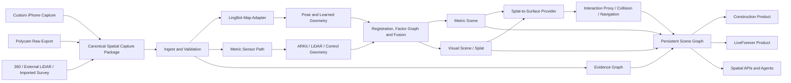

# Spatial Intelligence Platform (SIP)

**Version:** 1.1.0  
**Status:** Build-ready engineering baseline  
**Baseline date:** 2026-07-27  
**Primary research baseline:** LingBot-Map commit `1f480aeb8a47a24656090d46d053115b7fe60435`

## What this specification defines

SIP is an open, modular spatial-intelligence platform that converts synchronized camera, LiDAR, depth, pose, inertial, drawing, document, interview, and media evidence into a persistent, searchable, versioned representation of places. The same platform supports two initial products:

1. **Construction Spatial Reference** — field capture, as-built context, systems documentation, progress history, deficiencies, commissioning, drawings, RFIs, and owner handoff.
2. **LiveForever Spatial Memory** — places, objects, people, interviews, photographs, recordings, timelines, conflicting recollections, and clearly labeled reconstructions.

SIP is not specified as a clone of Polycam. Polycam is one optional capture source through raw export. SIP also defines an independent iPhone ARKit/LiDAR capture application so the platform owns its canonical data and can accept future sensors without changing the domain model.

## The central architecture

## Four coordinated representations, one coordinate system

SIP deliberately refuses to collapse all output into a single pretty model:

| Representation | Purpose | May be authoritative? | Typical contents |
|---|---|---:|---|
| **Metric scene** | geometry, navigation reference, measurements, change analysis | only after defined verification | calibrated point clouds, TSDF, metric meshes, control points, verified dimensions |
| **Visual scene** | photoreal presence and human understanding | no, by appearance alone | Gaussian splats, textured visual meshes, photographs, lighting-preserving assets |
| **Interaction scene** | selection, collision, locomotion, clipping, occlusion, spatial audio | no; always derived and use-bounded | proxy meshes, collision volumes, navigation surfaces, occlusion hulls |
| **Evidence model** | truth, provenance, consent, records, uncertainty | yes, only for facts the evidence supports | captures, interviews, drawings, documents, witnesses, model manifests, review decisions |

Design/BIM geometry is registered alongside these layers with `design_authority`; it does not silently become an observed or verified-as-built condition. All representations use named coordinate frames and may be revised independently. A proxy can be regenerated without rewriting a memory or equipment identity; a visual scene can become more beautiful without changing a verified dimension; a new scan can supersede metric geometry while preserving history.

## Non-negotiable rules

- Original captures and source records are immutable.
- Every derivative records exact inputs, code, model/checkpoint, parameters, hardware-relevant settings, output hashes, and validation.
- Learned depth, generated texture, inferred identity, and reconstructed memory are labeled; they never silently become measured fact.
- Construction data distinguishes design intent, observation, verified as-built condition, and proposed work.
- LiveForever preserves consent, provenance, contradictory testimony, and posthumous governance.
- Dependency approval evaluates source code, model weights, datasets, and transitive components separately.
- The system supports local-only, hybrid, and cloud deployments using the same canonical schemas.
- All long-running work is resumable, cancellable, observable, and idempotent.
- Open exports are mandatory: IFC/BCF where applicable, glTF/GLB for runtime scenes, OpenUSD for rich scene interchange, point-cloud formats, and standard media/document formats.

## Version 1.1 hybrid-representation amendment

Version 1.1 formalizes the bridge between Gaussian splats and conventional geometry. A splat may remain the photoreal visual layer while a separate, derived interaction proxy supplies raycasting, collision, navigation, clipping, occlusion, spatial-audio boundaries, and compatibility with mesh-oriented runtimes. The proxy is explicitly disposable and non-authoritative. Construction measurements must resolve to eligible metric or field evidence; LiveForever historical claims must resolve to source evidence and testimony.

The implementation is provider-based. Local open-source candidates, private managed services, research methods, and manual external tools all use the same quarantine, validation, provenance, and publication contracts. SplatEdit is an experimental manual provider only until its source/API, data-processing, retention, security, and commercial posture are approved.

Start with [`V1_1_HYBRID_REPRESENTATION_CHANGESET.md`](V1_1_HYBRID_REPRESENTATION_CHANGESET.md), the normative [`MIGRATION_FROM_1.0.md`](MIGRATION_FROM_1.0.md), and the operational [`V1_1_MIGRATION_GUIDE.md`](V1_1_MIGRATION_GUIDE.md), then read:

- [`20-architecture/211_hybrid_representation_services.md`](20-architecture/211_hybrid_representation_services.md)
- [`40-reconstruction/415_splat_surface_hybrid_representation.md`](40-reconstruction/415_splat_surface_hybrid_representation.md)
- [`40-reconstruction/416_splat_surface_provider_contract.md`](40-reconstruction/416_splat_surface_provider_contract.md)
- [`40-reconstruction/417_bidirectional_mesh_splat_interop.md`](40-reconstruction/417_bidirectional_mesh_splat_interop.md)
- [`40-reconstruction/418_splat_editing_cleanup.md`](40-reconstruction/418_splat_editing_cleanup.md)
- [`50-data/514_hybrid_representation_asset_contract.md`](50-data/514_hybrid_representation_asset_contract.md)
- [`60-platform/613_hybrid_scene_runtime.md`](60-platform/613_hybrid_scene_runtime.md)
- [`60-platform/614_splat_surface_api_and_events.md`](60-platform/614_splat_surface_api_and_events.md)
- [`70-construction/714_hybrid_representation_construction.md`](70-construction/714_hybrid_representation_construction.md)
- [`80-liveforever/814_hybrid_representation_liveforever.md`](80-liveforever/814_hybrid_representation_liveforever.md)
- [`90-security-ops/913_external_spatial_provider_governance.md`](90-security-ops/913_external_spatial_provider_governance.md)
- [`95-testing-delivery/961_splat_surface_benchmark_acceptance.md`](95-testing-delivery/961_splat_surface_benchmark_acceptance.md)

## Important LingBot-Map decision

LingBot-Map is integrated as a replaceable reconstruction adapter, not the system of record. Its repository code advertises Apache 2.0 and provides streaming/windowed inference, per-frame predictions, camera estimates, confidence filtering, and long-sequence examples. The downloaded checkpoint and its complete commercial-use provenance must still pass the model-governance gate before production use. SIP therefore supports three operational modes:

- `research_only`: experimentation with access-controlled data and no commercial output;
- `commercial_approved`: checkpoint and dependencies have signed approval records;
- `disabled`: adapter remains installed but cannot execute.

This avoids making the entire product depend on an unresolved weight license or one model's accuracy envelope.

## How to read the bundle

Start with:

1. `MASTER_SPECIFICATION.md` — system-wide decisions and end-to-end behavior.
2. `DECISION_SUMMARY.md` — concise list of binding architectural choices.
3. `SPEC_INDEX.md` — every document, grouped by domain.
4. `00-governance/005_requirements_traceability.md` — generated requirement inventory.
5. `20-architecture/203_repository_architecture.md` — proposed implementation repository.
6. `30-capture/304_canonical_capture_package.md` — source-neutral capture contract.
7. `40-reconstruction/400_lingbot_integration.md` and `401_lingbot_limitations_guardrails.md`.
8. `70-construction/700_vertical_overview.md` and `80-liveforever/800_vertical_overview.md`.
9. `95-testing-delivery/956_mvp_plan.md` and `958_epic_backlog.md`.

## Intended implementation stack

The specification does not require one vendor, but the reference profile uses:

- Swift, ARKit, RealityKit, RoomPlan, AVFoundation, CoreMotion, Metal, Network.framework, and BackgroundTasks on iPhone/iPad;
- Python 3.10+ GPU workers, PyTorch, LingBot-Map adapter, Open3D, GTSAM or Ceres-backed optimization, and optional RTAB-Map support;
- FastAPI control plane, durable workflow orchestration, PostgreSQL/PostGIS, Redis, S3-compatible object storage, and a search/vector service behind adapters;
- Next.js/React with WebGL/WebGPU-capable viewers, Three.js-compatible runtime assets, and optional native review tooling;
- glTF/GLB, OpenUSD/USDZ, IFC 4.3, BCF, PLY, E57, LAS/LAZ, OBJ, and 3D Tiles as appropriate;
- `gsplat`-based or equivalently permissive splat training/rendering for the commercial path.

Exact versions are pinned in implementation lockfiles and model manifests, not frozen in this conceptual overview.

## Definition of success

A successful first platform release can ingest a synchronized iPhone or Polycam capture, validate and preserve it, run independent metric and learned reconstruction paths, align their outputs, publish a confidence-aware scene revision, open it in a browser, attach spatial evidence, and export the project without proprietary lock-in. The same engine must demonstrate one construction workflow and one LiveForever workflow without forking the underlying scene model.
